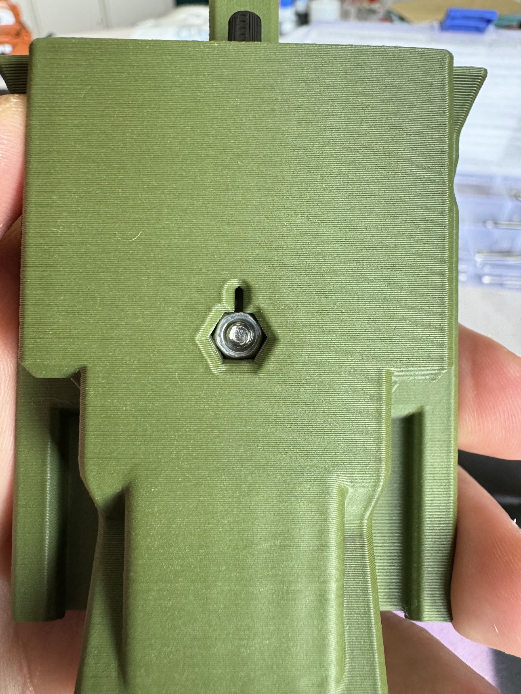
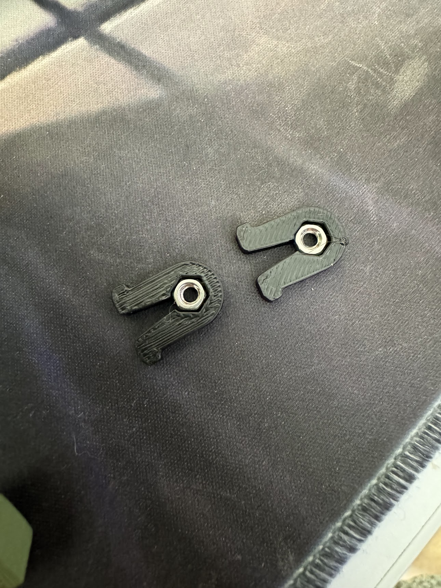
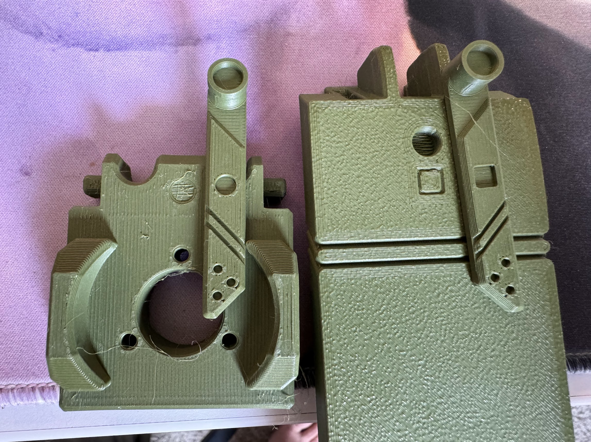

# Setup

This project is not cheap. Ordering just the McMaster-Carr parts off the BOM cost me ~$140. That said, you end up being able to build **10** Yeethammers. If you're just looking to build one, the easiest thing to do is just buy the [$50 hardware kit from BearsWaresUS](https://bearswares.shop/products/yeethammer-by-spyr-1).

On top of that, you'll use over 1.5kg of filament printing.

## Material Prep

The plunger springs (McMaster `9637K25`) are 11" long, and come in packs of 5. The BOM from Spyr calls for 5.5" springs, so cut these all in half for a total of 10 plunger springs.

The plunger tube is 8' long, and needs to be cut into 5.72" (approx 145mm) sections. This gets you 12 plunger tubes with wiggle room to spare.

## Nuts

Across various printed components, you'll see hexagonal holes. These are meant to have M3 hex nuts inserted into them.

Similarly, when you use `nut-clip`s, you will need to insert hex nuts into them before squeezing them into place.

## Magnets

The `magnet-helpers` have a square and circle on them. The magnet slots on the components have matching symbols. It doesn't matter which one has which polarity, as long as the tools stick together and you make sure to use the matching tool on each part.

## Pins

The pins have lengths of 8mm, 12mm, 21.5mm, and 28.2mm (and `hinge`). I'll be referring to them as small (S), medium (M), large (L), and extra large (XL) respectively.

## Video

Spyr has a [2.5 hour long video on YouTube](https://www.youtube.com/watch?v=rexejGUPc0k&list=PLAhWMbkMdmbdqtUxXlhaS-XgnqBFM62RJ&index=2) that documents the Yeethammer build as best as possible. I used `ffmpeg` to rotate the video 180 degrees and play it back at 2x speed in order to try and determine some build instructions.