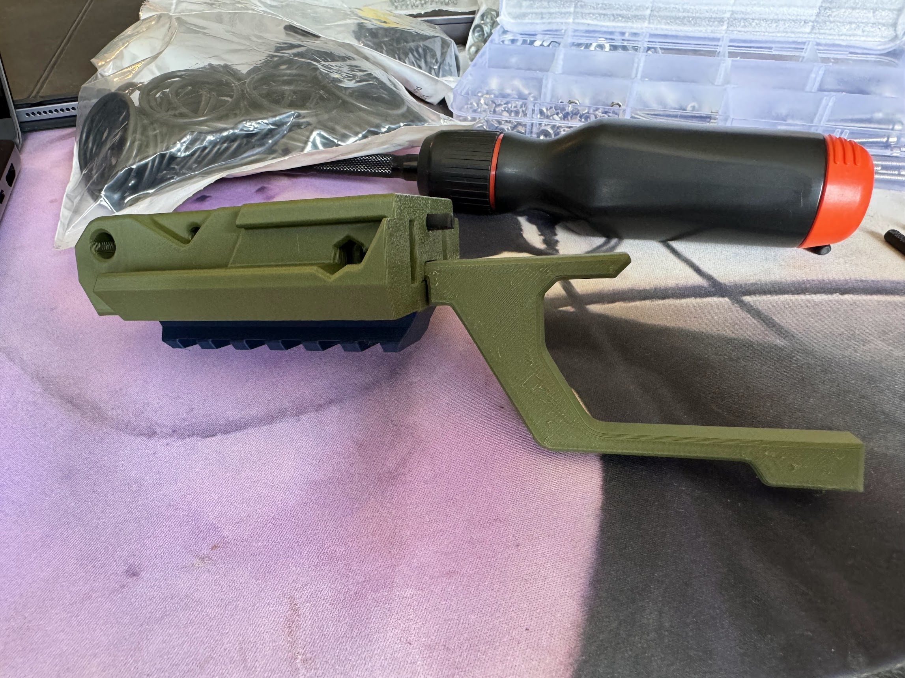
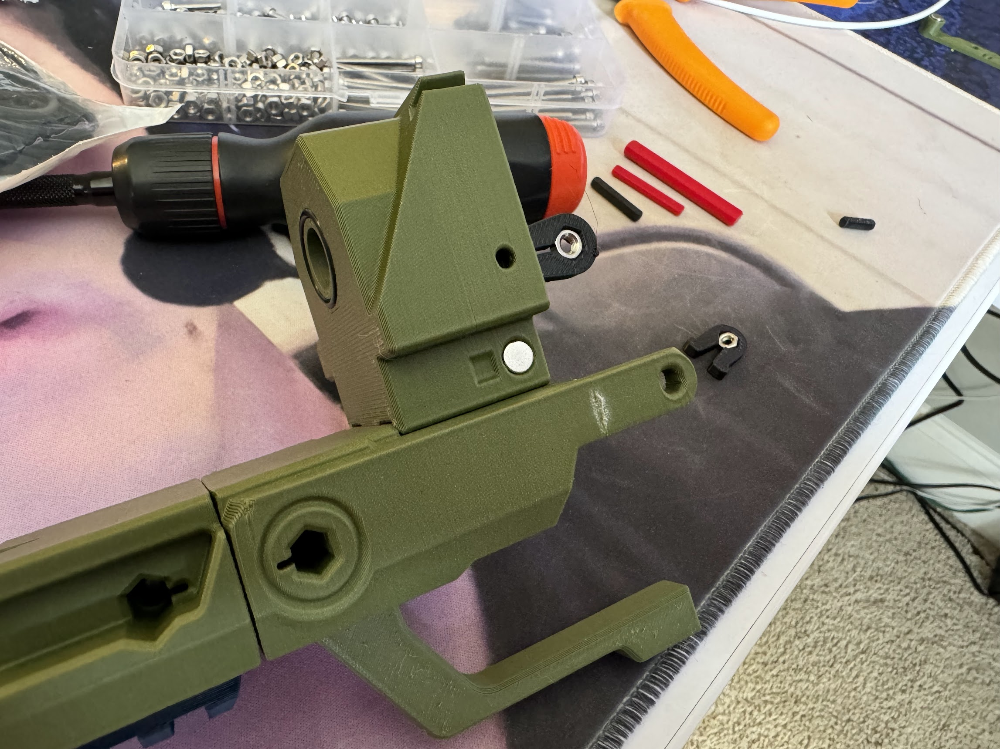
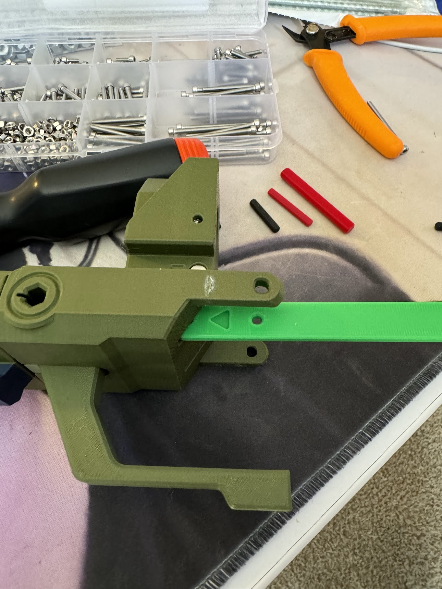
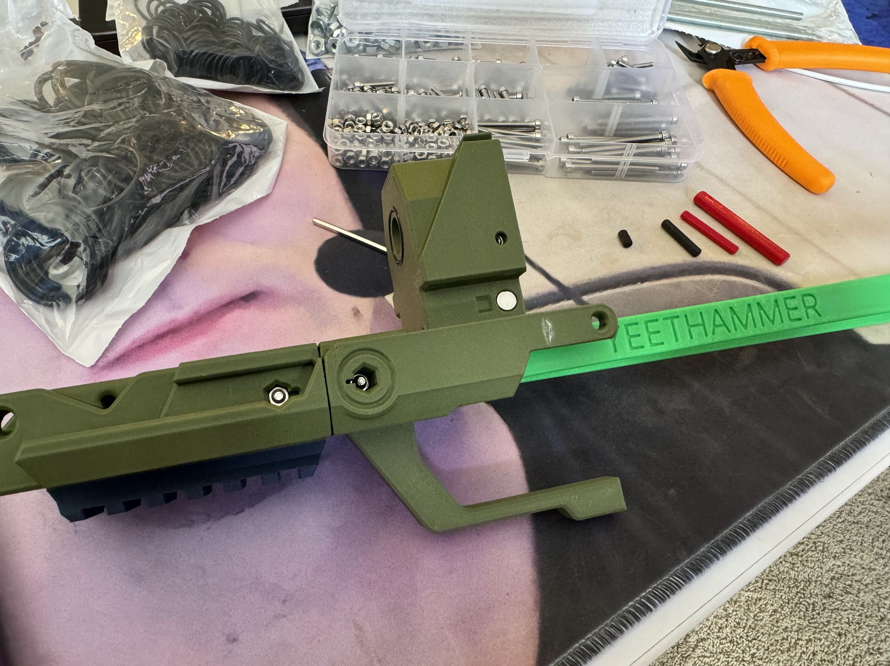

# Body

## Parts Needed

### Printed

* `picatinny-bottom`
* `printed-bar-r`
* `printed-bar-l`
* `trigger-guard`
* `body-passthrough`
* `body-breech-cradle-fore`
* `body-breech-cradle-aft`
* `grip`
* `pin-12mm` x 1
* `nut-clip` x 2

### Other Materils

* 25mm M3 bolt x 1
* 35mm M3 bolt x 1
* M3 hex nut x 5
* Small O-ring (McMaster `9452K6`) x 1
* 6mmx3mm magnets x 2

## Steps

First, slide `picatinny-bottom` onto `body-breech-cradle-force`. Secure it with a 23mm M3 bolt and nut. Then insert a 12mm (M) pin and `trigger-guard` into `body-breech-cradle-force`.

Next, slide `body-passthrough` onto `body-breech-cradle-aft`, and connect `-aft` to the previously assembled `-fore`. Place two `nut-clip`s with M3 nuts into the backside of `body-passthrough` (shown half-way inserted in the photo below). Glue in magnets using the square magnet tool, and put an O-ring on the front of `body-passthrough`.

With that complete, slide the two long bars (`printed-bar-r/l`) through the body, and secure with two 35mm bolts and M3 nuts. Make sure the arrows on the bars point forward (into what you have built so far).

