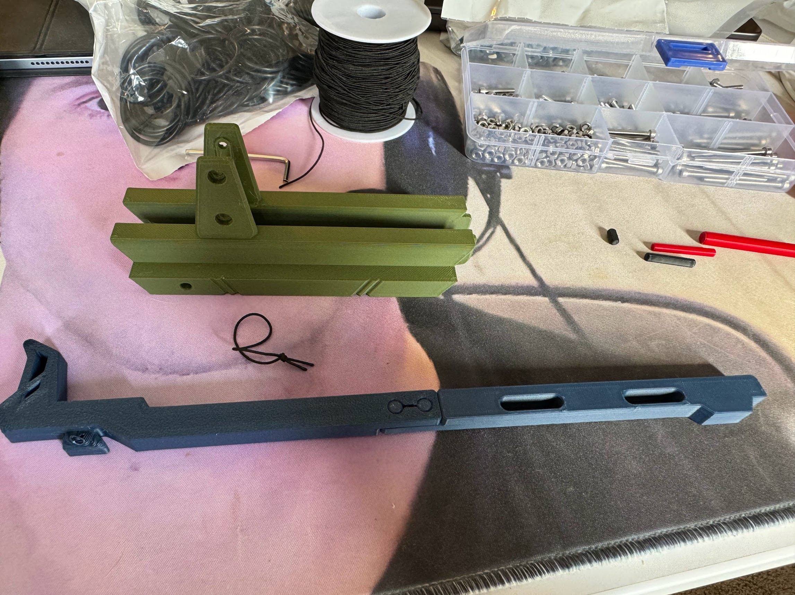
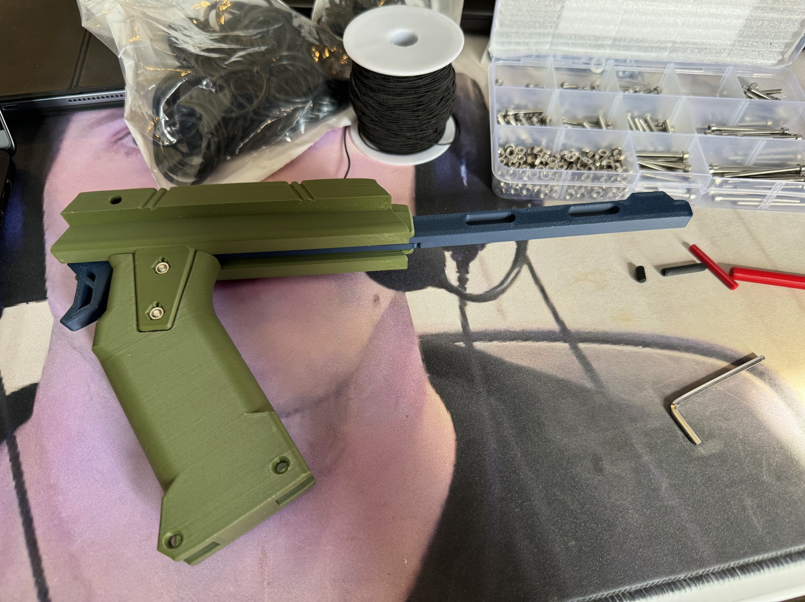
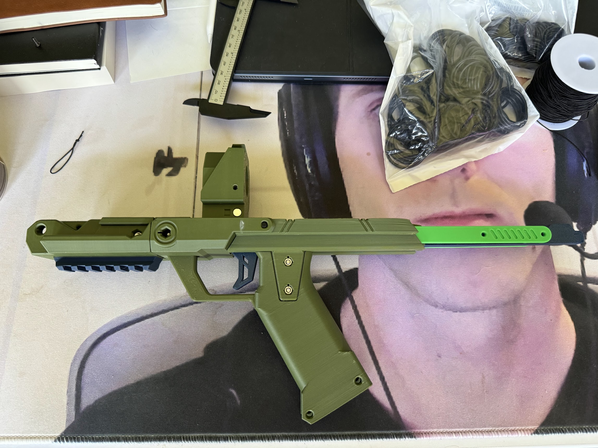

# Grip

## Parts Needed

### Printed

* `body-grip-attachment`
* `grip`
* `trigger-fore`
* `trigger-aft`
* `pin-8mm` x 2

### Other Materils

* 20mm M3 bolt x 2
* M3 hex nut x 2
* 6mmx3mm magnets x 2
* 45mm elastic loop (cut to 120mm)

## Steps

Start by snapping `trigger-fore` and `trigger-aft` together into one long piece. Cut a ~120mm piece of elastic and loop it to make a single ~45mm loop. Make it a double loop by making a figure-eight and folding it on itself, then wrap it around the hooks in `trigger-fore` and the valley in `body-grip-attachment`. It should cause the trigger to push forward after being depressed/squeezed.

After you get the elastic loop in place, prevent the trigger from falling out by installing `grip` and securing it with two 20mm bolts.

Finally, slide the grip assembly onto the rails and secure with two 8mm (S) pins.

