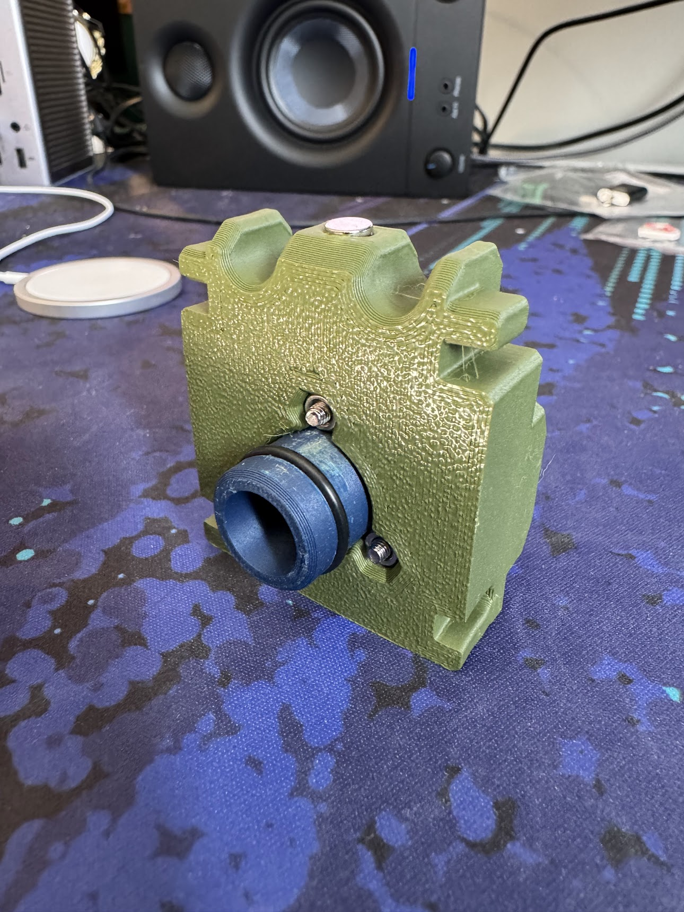

## Plunger

## Parts Needed

### Printed

* `plunger-tube-cap-100`
* `plunger-tube-priming-block-100`
* `body-pt-guide-fore`
* `body-pt-guide-aft`
* `nut-clip` x 2
* `grip-cover`
* `thumbhole-stock`

### Other Materils

* 25mm M3 bolt x 3
* 30mm M3 bolt x 1
* M3 hex nut x 6
* 6mmx3mm magnets x 1
* Small O-ring (McMaster `9452K6`) x 1
* Large O-ring (McMaster `9452K87`) x 1
* Super glue
* Plastic tube

## Steps

Insert `plunger-tube-cap-100` through `plunger-tube-priming-block-100`. Secure with three 25mm bolts and hex nuts. Use the circle magnet tool to insert a magnet, and attach an O-ring onto each side.

After that is complete, slide the plastic tube over the plunger cap, securing it with super glue.

Push two `nut-clips` into `body-pt-guide-fore`, and then slide both `body-pt-guide-fore` and `body-pt-guide-aft` onto the body rails, making sure that `thumbhole-stock` and `grip-cover` are in place, as they will not be able to be added once the screws are in place. Once that is all lined up (photo below), use a 30mm bolt/nut to secure `body-pt-guide-aft` to the rails and keep everything in place.

