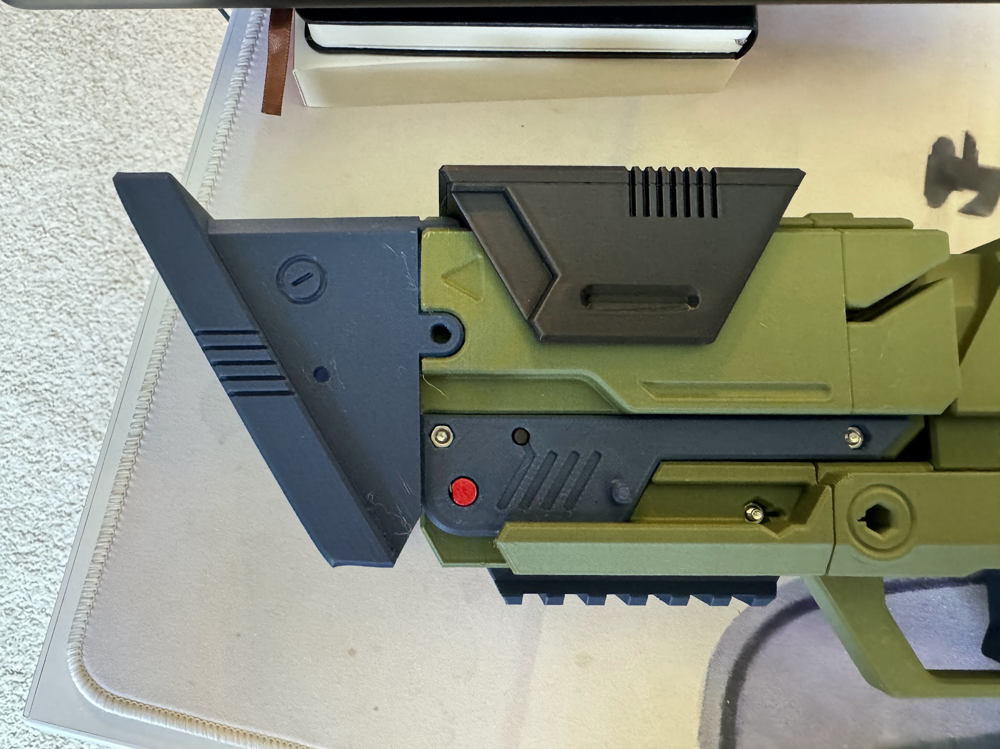

## Breech

## Parts Needed

### Printed

* `breech-fore`
* `breech-aft`
* `breech-ejector`
* `breech-ejector-sear`
* `breech-lifter-nut`
* `breech-lifter-bolt`
* `cam-track-fore-r`
* `cam-track-aft-r`
* `cam-track-fore-l`
* `cam-track-aft-l`
* `hinge-pin`
* `pin-8mm` x 2
* `pin-215mm` x 2
* `breech-fore-shroud`
* `breech-cover-top-fore`
* `breech-cover-top-aft`
* `breech-cover-insert-r`
* `breech-cover-insert-l`
* `breech-cover-l`
* `breech-cover-r`
* `picatinny-top`
* `plunger-cover-top`
* `plunger-cover-r`
* `plunger-cover-l`
* `cam-track-cover-r`
* `cam-track-cover-l`

### Other Materils

* 8mm M3 bolt x 5
* 12mm M3 bolt x 1
* 16mm M3 bolt x 2
* 40mm M3 bolt x 2
* M3 hex nut x 6
* Bowden tubes
* Dowel pin x 1
* 35mm elastic loop (cut to 100mm)
* 60mm elastic loop (cut to 150mm)
* 300mm elastic loop (cut to 650mm)

## Steps

Start by grabbing `breech-fore` as the basis to build off of. `breech-ejector-sear` inserts into the bottom, held in by the dowel pin, and pressed into a return position by the 35mm elastic wrapped through the holes as shown in the picture.

> [!IMPORTANT]
> The sear should rotate easily. If the dowel pin is too snug, file down the holes it inserts through until it rotates freely. Err on the side of "very snug" for the elastic to ensure it presses back correctly.

After the sear is in place, cut four bowden tubes to length and slide them into the channels inside of the breech.

Next, attach `breech-fore` to the previously assembled body by pushing two `pin-215mm`s into the bottom sides of the breech, then sliding the 60mm elastic through the body and looping it over the two pins.

Secure the two pieces with `breech-lifter-nut`/`-bolt`, `hinge-pin` (red in the following picture), and a 40mm bolt.

Setting down the main body for a second, assemble the shell ejector by attaching the 300mm loop (folded over itself, for a size of 150mm) to `breech-ejector` and `breech-aft`. **Ensure that the sear indent is facing down**.

> [!NOTE]
> You'll need to push the full length of a Silly Shell into this, so err on the side of being loose rather than snug.

Slide this combo into the rear of the breech, and secure it to the previously connected breech lifters with a 40mm bolt.

Now we can start attaching the decorative pieces. Connect `breech-cover-insert-r`/`-l` with their pins to the inside of `breech-cover-top-fore`. Slide it over the front of the breech, then place `breech-fore-shroud` on the front and secure with two `pin-8mm`s.

> [!WARNING]
> I forgot to attach the `breech-cover-insert`s in the photo below, and had to disassemble several pieces to get them inserted. Don't make the same mistake.

Build the cam tracks by connecting `cam-track-fore-r`/`-l` and `cam-track-aft-r`/`-l`. Insert two magnets into each, making sure you use the circle magnet tool. Align them along the sides of the breech and plunger.

Before Putting the rest of the breech covers on, make sure to insert a M3 hex nut into the top of `breech-aft`. It will not be accessible once the covers are on.

Connect `breech-cover-aft` to `breech-cover-l` and `breech-cover-r`.

Slide the three-piece assembly over the back of the breech, making sure the inner pieces line up with the channels correctly. It may help to tilt the breech up (in the "eject" position) while sliding this on. Secure each side with an 8mm bolt, making sure to place the nuts in their proper locations inside of the shroud.

Finally, secure `picatinny-top` with a 12mm bolt in the rear, and 8mm bolt in the front. This part has an arrow printed on the bottom to show which way it should point (arrow forward).

Now that the cam tracks are in place, the `plunger-cover-top`, `-l`, and `-r` can be combined and slid over the plunger.

The easiest way to do this is likely to manually pull the plunger tube back, causing the breech to open, giving you room to have the plunger cover assembly slightly forward and able to have the rails/channels on the upper side lined up.

Once in place, secure it with two 8mm bolts in the rear, and two 16mm bolts going through `cam-track-cover-r`/`-l`.

> [!NOTE]
> Yes, I recognize the end here feels like it should be with the "plunger" instructions, but the covers can't be put on until the cam tracks are in place.