## Buttstock

## Parts Needed

### Printed

* `plunger-head-100`
* `plunger-rod-100`
* `body-aft`
* `plunger-guide`
* `pin-8mm` x 2
* `aft-cover-top`
* `aft-cover-r`
* `aft-cover-l`
* `catch-lifter-bracket`
* `catch-lifter`
* `catch-lifter-linkage`
* `catch-100`
* `takedown-handle-nut`
* `takedown-handle-bolt`

### Other Materils

* 10mm M3 bolt x 2
* 30mm M3 bolt x 4
* 45mm M3 bolt x 1
* M3 hex nut x 7
* Large O-ring (McMaster `9452K87`) x 1
* Pen spring (McMaster `9657K644`) x 1
* Dowel pin x 1

## Steps

Start by attaching the `plunger-head-100` to `plunger-rod-100` with a 30mm bolt and nut. Attach the large O-ring to the head.

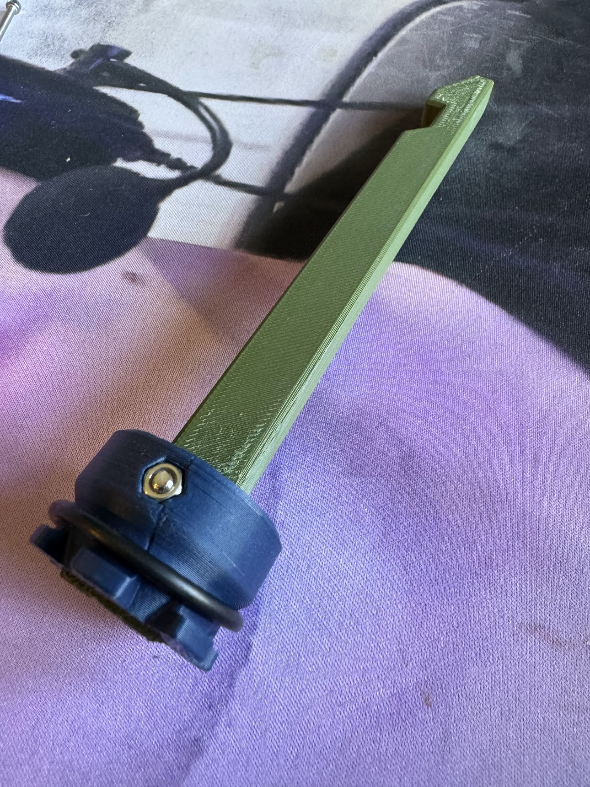

Prepare the `body-aft` by inserting two M3 nuts into the areas shown.

> [!IMPORTANT]
> Make sure to not miss this step, as you won't be able to get them in without taking the whole thing apart after this step.

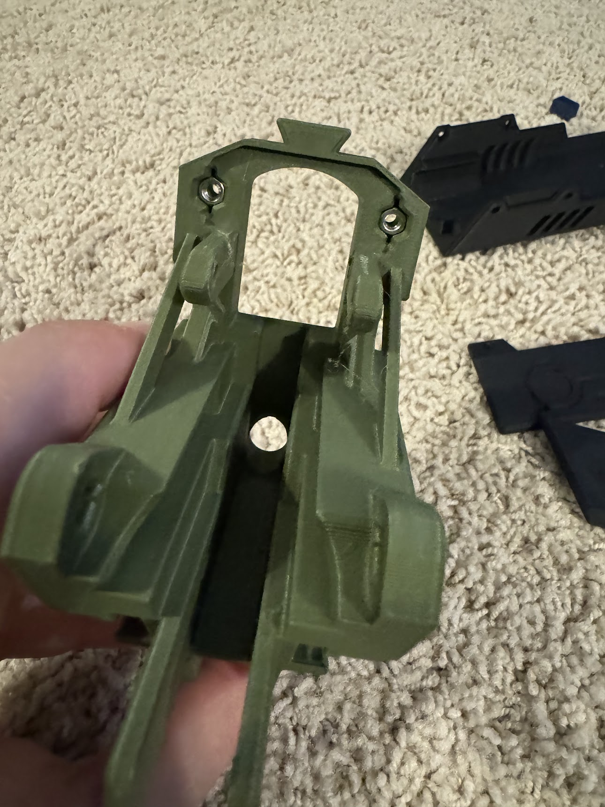

Slide `plunger-guide` into `body-aft`, securing it with two `pin-8mm`s (S).

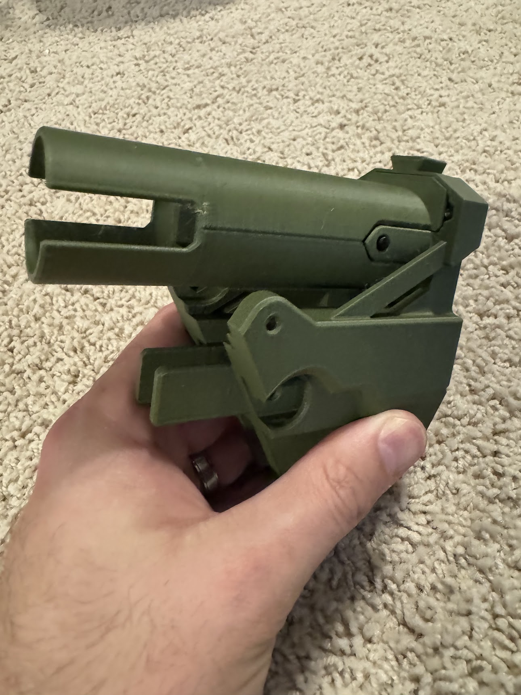

Combine `aft-cover-top`, `aft-cover-r`, and `aft-cover-l`. Slide the combined pieces onto the dovetail on top of `body-aft`. Attach them with two 10mm bolts, making sure to put the hex nuts in the corresponding slots inside `body-aft`.

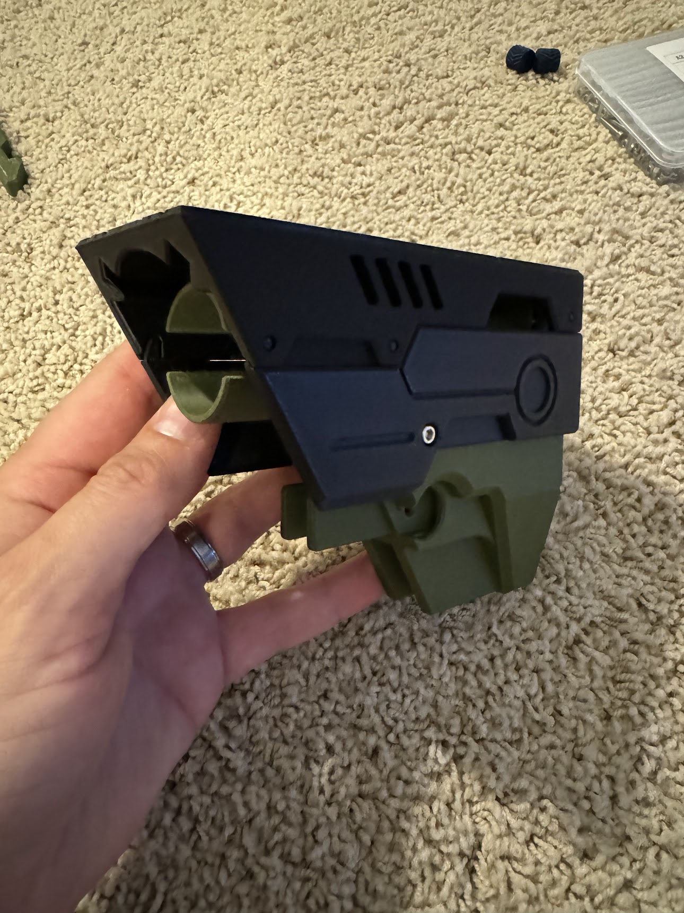

Set the current assembly to the side for a bit, and grab `catch-lifter-bracket` and `catch-lifter`. Attach them together as shown in the photo with a dowel pin.

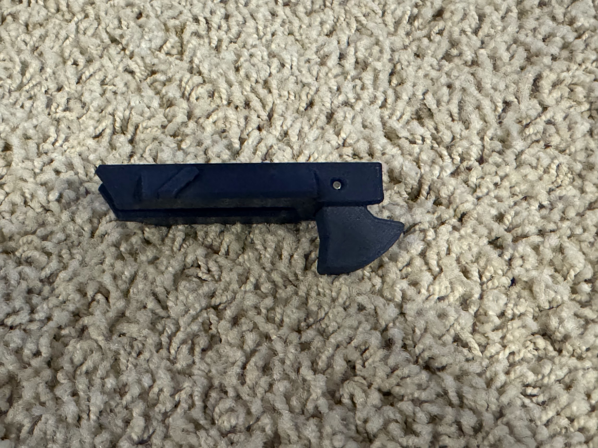

Slide the catch lifter assembly into the `body-aft`. Push it back until it clicks into place.

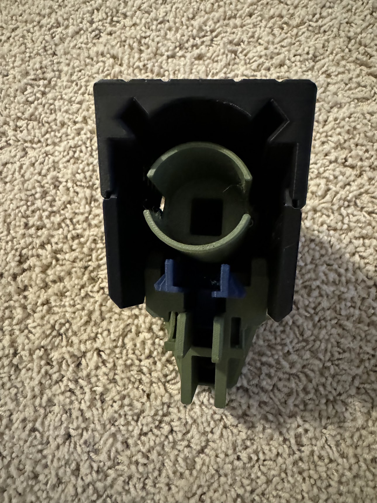

Flip the buttstock around, and place `catch-lifter-linkage` into the small hole, and add `catch-100`, providing tension with the pen spring.

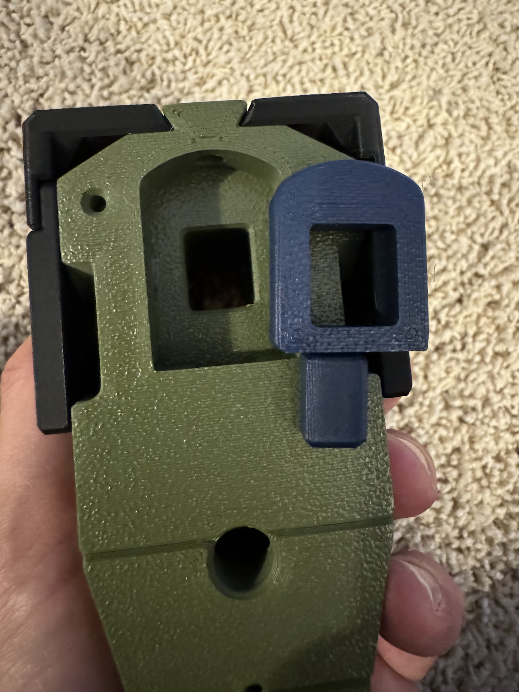
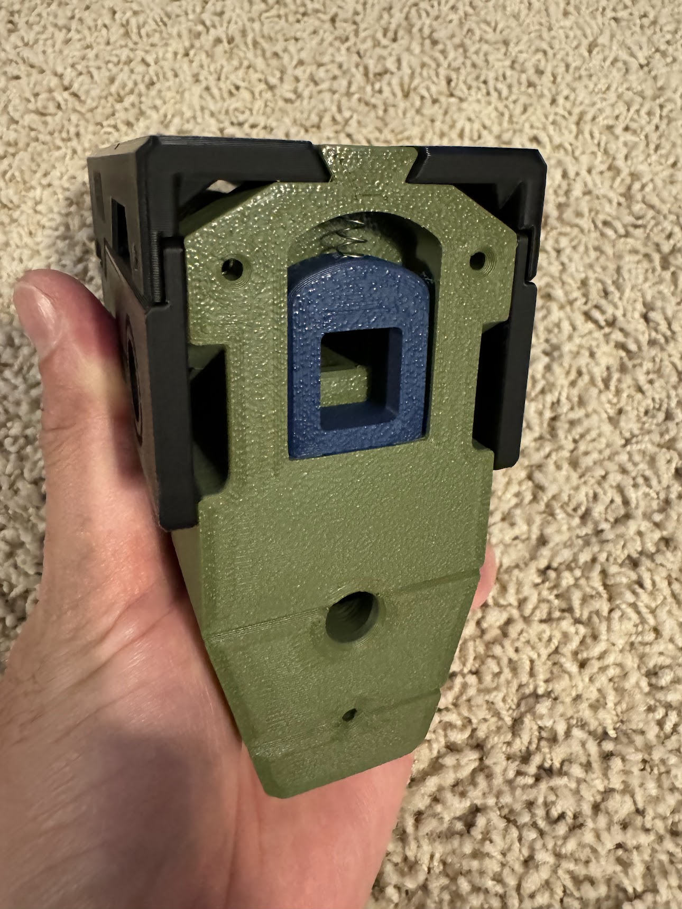

Line up `buttstock-fore` and `buttstock-aft`, securing with three 30mm bolts. You inserted the top two earlier, but will need to place the lower M3 nut into the bottom.

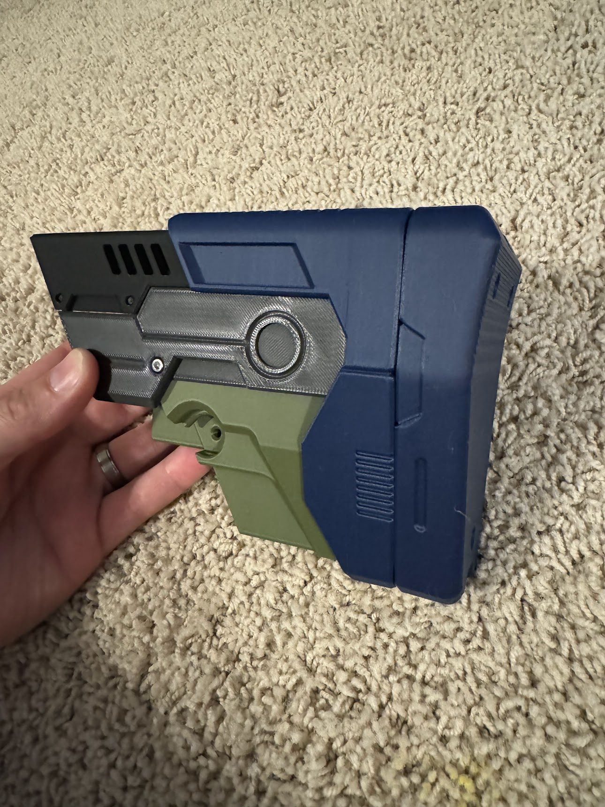

Place the large spring around the plunger rod, and slide it into the `body-aft`, notch side up. Press it in until it clicks into place.

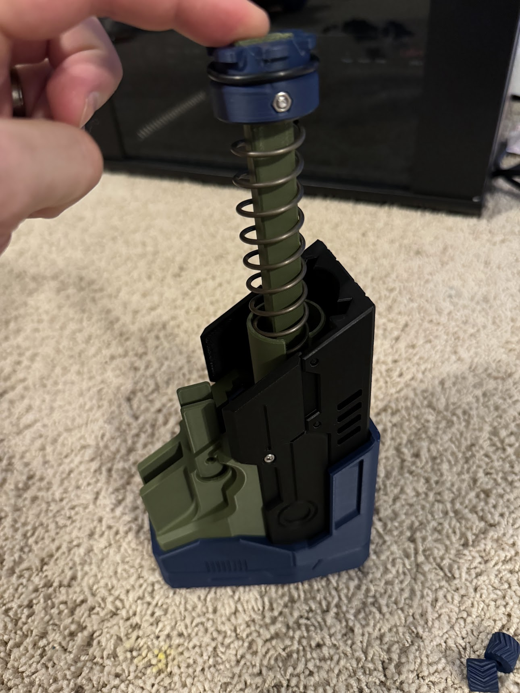
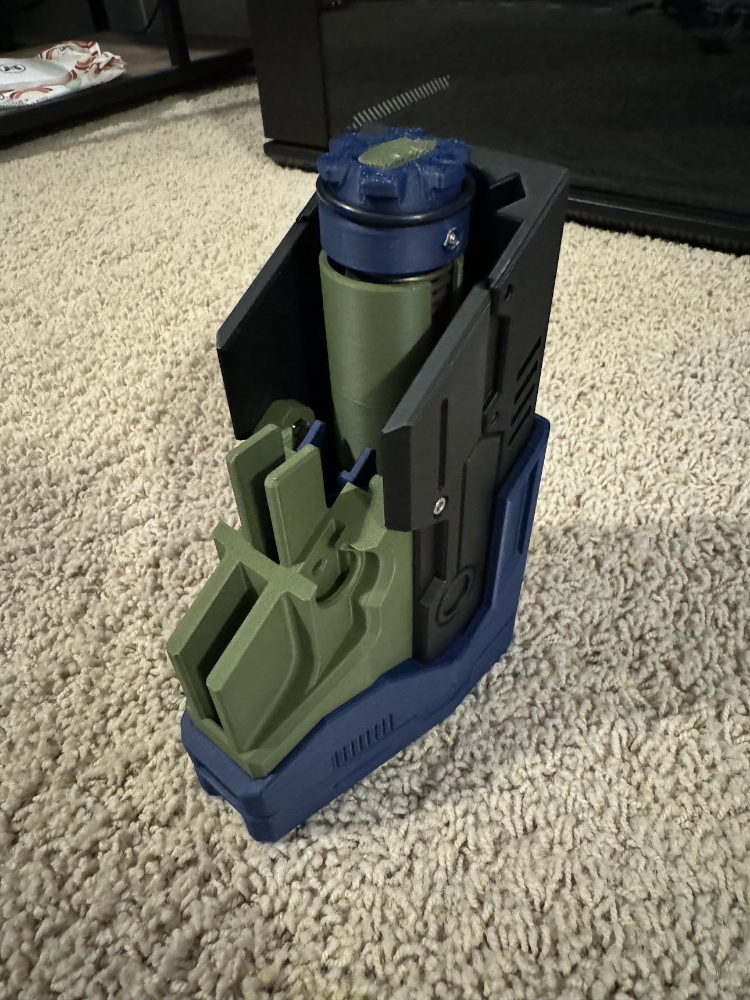

Add lubricant to the O-ring on the plunger (and optionally into the inside of the plastic tube itself), and line up the rear assembly onto the rest of the body.

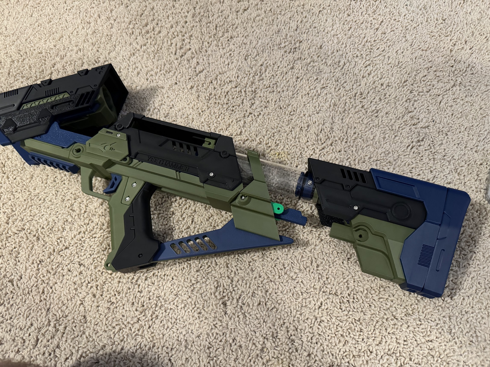

Use a 45mm bolt, M3 nut, `takedown-handle-nut` and `takedown-handle-bolt` to secure the rear assembly onto the body.

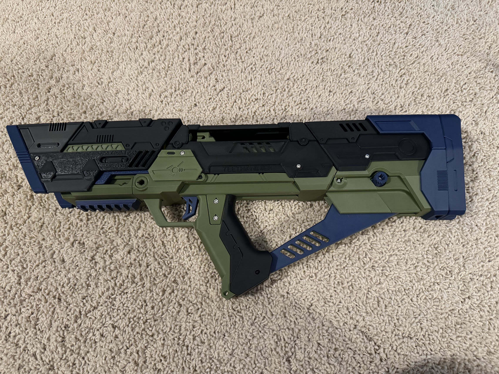