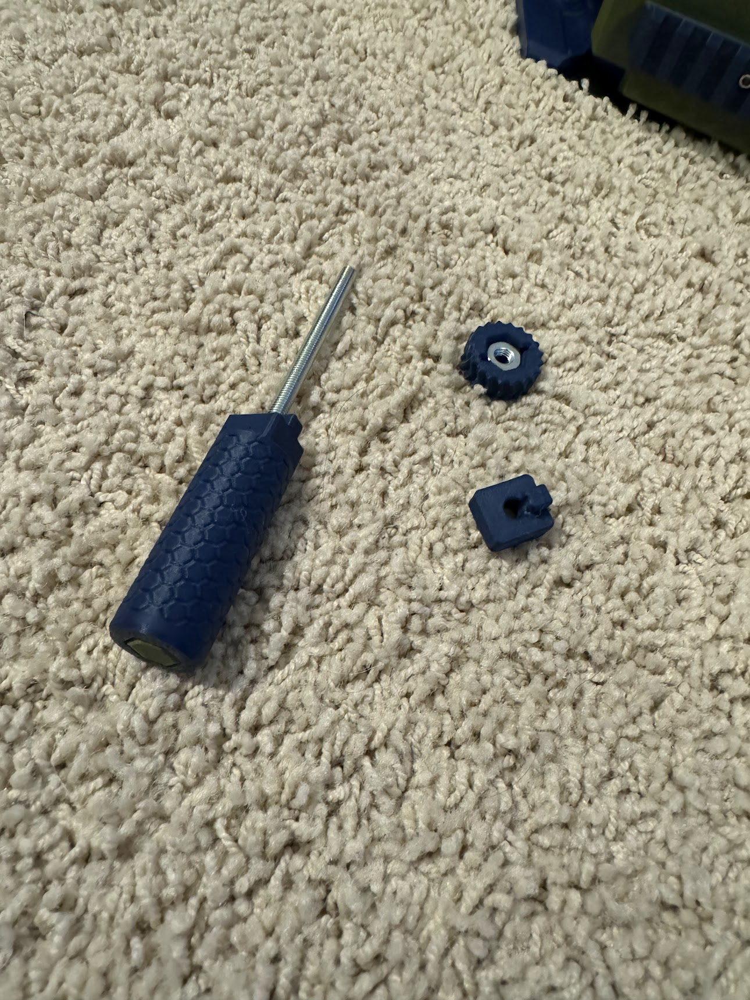
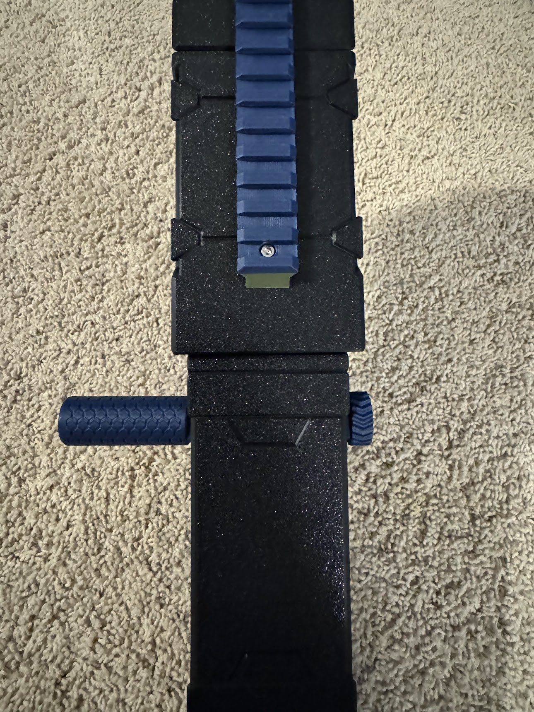
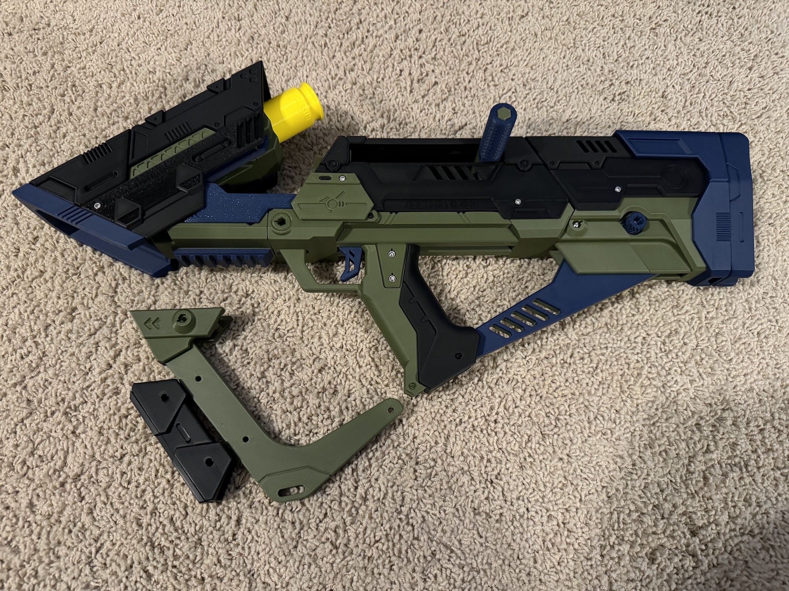

## Final

## Parts Needed

### Printed

* `priming-handle-grip`
* `priming-handle-grip-insert`
* `priming-handle-nut`
* `priming-handle-spacer`

### Other Materils

* 10-32 Threaded Rod
* 10-32 Hex Nut x 2

## Steps

Put the threaded rod through one of the hex nuts and slide it into `priming-handle-grip`. Lock it in place using `priming-handle-grip-insert`.

Slide the rod through the already installed plunger priming assembly, and secure it in place by putting `priming-handle-spacer`, `priming-handle-nut`, and the hex nut on the other side.

### Optional Fore Grip

If you want, you can install `foregrip-bar` and `foregrip-cover` on the lower picatinny rail with a 30mm hex bolt and three `pin-215mm` (Large). It is perfectly functional without it, so the choice is up to you.

